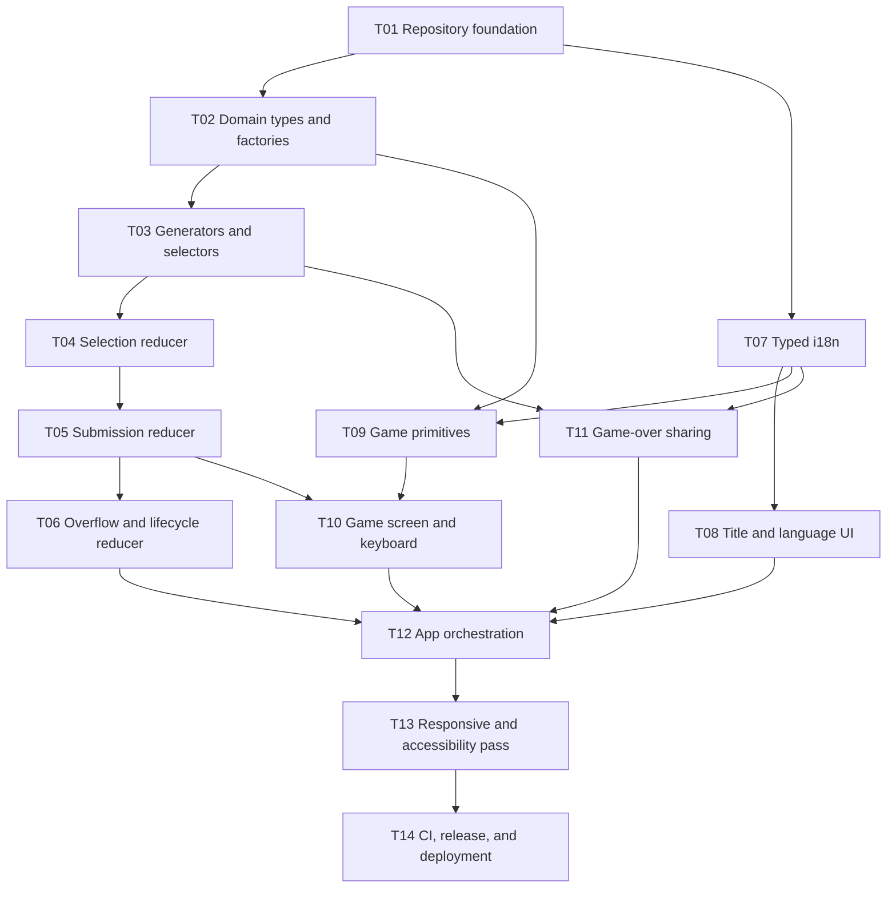

# 1-0 PoC — Complete Specification, Implementation Plan, and Loop-Agent Checklist

> **For agentic workers:** REQUIRED SUB-SKILL: Use `superpowers:subagent-driven-development` (recommended) or `superpowers:executing-plans` to implement this plan task-by-task. Steps use checkbox (`- [ ]`) syntax for tracking.

**Goal:** Build and deploy a responsive, bilingual, fully client-side proof of concept for `1-0`, an endless multiplication game in which digit tiles are both answer inputs and a managed inventory.

**Architecture:** A Vite + React + TypeScript single-page application uses a deterministic `useReducer` state machine for the five game phases. Pure domain utilities own equation generation, rewards, answer construction, sorting, loss detection, and share formatting; React owns rendering and event orchestration. Random values and tile IDs are injected at the boundary so all game rules remain deterministic in tests.

**Tech Stack:** Vite, React, TypeScript, CSS Modules, Vitest, React Testing Library, `@testing-library/user-event`, Vercel.

**Primary references:** [Vite setup](https://vite.dev/guide/), [React `useReducer`](https://react.dev/reference/react/useReducer), [Vitest](https://vitest.dev/guide/), [React Testing Library](https://testing-library.com/docs/react-testing-library/intro/), [Web Share API](https://developer.mozilla.org/en-US/docs/Web/API/Web_Share_API), [`localStorage`](https://developer.mozilla.org/en-US/docs/Web/API/Window/localStorage), [Vite on Vercel](https://vercel.com/docs/frameworks/frontend/vite).

## Global Constraints

- Product name is the working title `1-0`.
- Use Vite + React + TypeScript; do not use Next.js.
- Run entirely in the browser; no backend, database, account, leaderboard, API, analytics, or anti-cheat system.
- Use React `useReducer`; do not add Zustand, Redux, or another state library.
- Keep the reducer pure and deterministic; never call `Math.random()`, `crypto.randomUUID()`, browser APIs, or storage APIs inside it.
- Use CSS Modules plus one global stylesheet; do not add Tailwind, a component library, or an animation library.
- Use CSS transitions only, and only for functional state changes.
- Support responsive desktop and mobile layouts with mouse, touch, and keyboard input.
- Support English and Korean through a typed in-code dictionary; do not add an i18n dependency.
- Persist only the language preference in `localStorage`; never persist a run, score, record, equation, or inventory.
- Use Vitest and React Testing Library; do not add Playwright or another E2E suite.
- Use ordinary browser randomness in production; do not generate, display, encode, or share run seeds.
- Do not add sound, music, mute, or volume controls.
- Deploy the static Vite build to Vercel.
- Do not implement future wildcards, a leaderboard, result URLs, saved records, accounts, tutorials, or backend validation.
- Every task is implemented test-first, produces one independently reviewable result, and ends in a focused commit.
- Do not start an issue until every `depends_on` issue has passed its completion gate.

---

## 1. Canonical Product Specification

### 1.1 Product thesis

`1-0` is an endless arithmetic inventory game. A digit tile is simultaneously:

1. a resource required to construct an answer;
2. a consumable spent on every submission; and
3. an inventory-management choice because correct play returns one net tile before capacity resolution.

The PoC validates whether this loop is understandable and engaging. It does not validate competition, retention, monetization, anti-cheat, or online services.

### 1.2 Equation pool and randomness

- Operands are integers `1` through `9`, inclusive.
- The sampling pool contains the 45 unordered pairs `(a, b)` where `1 <= a <= b <= 9`.
- Draw one pair uniformly with replacement for every new equation.
- Immediate repetition is legal.
- After drawing the unordered pair, independently randomize display order.
- `3 × 7` and `7 × 3` are presentations of one sampling entry, not two entries.
- Products range from `1` through `81`; an answer therefore has exactly one or two decimal digits.
- Rewards are independent uniformly distributed digits `0` through `9`; each digit has probability `10%`.
- Production uses `Math.random()`.
- Tests provide deterministic `RandomSource` functions.

### 1.3 Initial run state

- Initial inventory capacity: `10`.
- Initial inventory: one tile for each digit `[0,1,2,3,4,5,6,7,8,9]`.
- Inventory display order: ascending digit; duplicates are ordered deterministically by tile ID.
- Score: `0`.
- Current streak: `0`.
- Longest streak: `0`.
- Submitted rounds: `0`.
- Current equation ordinal: `1`.
- A run begins only after the player presses **Start Run**.

### 1.4 Answer construction

- The product's canonical decimal representation determines the slot count.
- One-digit products show one answer slot.
- Two-digit products show two ordered answer slots.
- Clicking or tapping an inventory tile moves that exact tile into the leftmost empty slot.
- Pressing a digit key selects the first available matching tile in sorted inventory order.
- Duplicate digit tiles have no strategic distinction.
- A selected tile leaves the inventory row and appears in its answer slot.
- Clicking or tapping a filled slot returns that tile to the inventory.
- `Backspace` returns the most recently selected answer tile.
- Returned tiles are re-sorted into inventory.
- The player cannot select more tiles than there are answer slots.
- **Submit** and `Enter` are enabled only when all slots are filled.
- Slot order is answer order: selecting `5` then `6` constructs `56`; selecting `6` then `5` constructs `65`.
- Every equation allows exactly one submission.

### 1.5 Correct submission

Given `N` submitted tiles:

1. Remove the `N` submitted tiles permanently.
2. Increment score by `1`.
3. Increment current streak by `1`.
4. Set longest streak to `max(previous longest streak, current streak)`.
5. Increment submitted rounds by `1`.
6. Generate exactly `N + 1` random reward tiles.
7. Insert all rewards into sorted inventory simultaneously.
8. Mark every reward as new for feedback presentation.
9. If inventory size exceeds `10`, enter overflow resolution immediately.
10. Otherwise enter feedback with **Next Round** enabled.

The score is the number of correct submissions, not a product-, speed-, streak-, or difficulty-weighted value.

### 1.6 Incorrect submission

Given `N` submitted tiles:

1. Remove the `N` submitted tiles permanently.
2. Do not change score.
3. Reset current streak to `0`.
4. Preserve longest streak.
5. Increment submitted rounds by `1`.
6. Generate no rewards.
7. Show the submitted answer and correct answer.
8. Enter feedback with **Next Round** enabled.

An incorrect answer is legal even when the correct answer cannot be constructed from current tiles. The game never performs an exact-answer-constructibility loss check. Intentional incorrect submissions are therefore a costly survival mechanism.

### 1.7 Overflow resolution

- Capacity is checked only after all correct-answer rewards have been inserted.
- `excess = inventory.length - 10`.
- If `excess > 0`, the player must discard exactly `excess` tiles.
- The player may mark any owned tile, including a new reward or an older tile.
- Marking is reversible until confirmation.
- **Confirm Discard** and `Enter` are enabled only when exactly `excess` tile IDs are marked.
- Confirmation removes those exact tiles, clears the overflow selection, and returns to feedback.
- The next equation cannot be drawn while overflow remains unresolved.

### 1.8 Next-round loss detection

When the player advances:

1. Generate the next equation outside the reducer.
2. Clear `isNew` on surviving inventory tiles.
3. Clear the previous answer selection, pending discards, and prior result.
4. Increment the equation ordinal.
5. Compare `inventory.length` with the new equation's answer-slot count.
6. If inventory has enough tiles, enter `answering`.
7. If inventory has fewer tiles than required slots, enter `gameOver`.

Loss is based only on tile count versus answer-slot count:

```ts
inventory.length < getAnswerLength(equation)
```

The terminal equation remains visible to explain why the run ended. It is not counted as a submitted round.

### 1.9 Statistics semantics

| Field | Definition |
|---|---|
| `score` | Number of correct submissions |
| `currentStreak` | Consecutive correct submissions ending at the latest submitted round |
| `longestStreak` | Maximum `currentStreak` observed during the run |
| `totalRounds` | Number of submitted equations, correct or incorrect |
| `round` | One-based ordinal of the currently displayed equation; in game over it is `totalRounds + 1` |

### 1.10 Screen phases

#### `title`

- Working title `1-0`.
- Three-line rules summary.
- Expandable **How to Play**.
- Visible `English / 한국어` language selector.
- One primary **Start Run** button.

#### `answering`

- HUD order: score, current streak, round.
- Equation and exact answer-slot count.
- Submit action.
- Sorted digit inventory.
- Mouse, touch, and keyboard input.

#### `feedback`

- **Correct** or **Incorrect** text.
- Subtle visual emphasis on equation and submitted tiles.
- Correct feedback shows inserted rewards highlighted.
- Incorrect feedback shows submitted and correct answers.
- Feedback persists until **Next Round** or `Enter`.

#### `overflow`

- Preserve the correctness feedback context.
- State how many tiles must be removed.
- Allow reversible tile marking.
- Enable confirmation only at the exact required count.
- After confirmation, move to `feedback`; do not draw the next equation automatically.

#### `gameOver`

- Keep the terminal equation visible.
- Show score, total submitted rounds, and longest streak.
- Show **Play Again**, **Share**, and **Copy Result**.
- **Play Again** starts a fresh Round 1 immediately without returning to title.

### 1.11 Keyboard contract

| Phase | Key | Effect |
|---|---|---|
| `answering` | `0`–`9` | Select first available matching tile if a slot is empty |
| `answering` | `Backspace` | Return most recently selected answer tile |
| `answering` | `Enter` | Submit only if all answer slots are filled |
| `overflow` | `Enter` | Confirm only if exactly the excess number is selected |
| `feedback` | `Enter` | Draw and advance to the next equation |
| `gameOver` | `Enter` | Start a fresh run, equivalent to **Play Again** |
| `title` | `Enter` | No global shortcut; the focused **Start Run** button retains normal browser behavior |

Disabled keyboard actions are no-ops. Language changes are available in every phase and never reset game state.

### 1.12 Responsive and visual contract

- Use one centered vertical arena on desktop and mobile.
- Preserve order across breakpoints: HUD → equation/slots → phase action → inventory.
- Mobile changes spacing, wrapping, and control size, not information architecture.
- Minimal number-board aesthetic.
- High-contrast typography, neutral surfaces, restrained accent use.
- Tiles resemble simple physical pieces.
- Use color plus text or shape; never color alone for correctness, selection, or discard state.
- Interactive targets are at least `44 × 44` CSS pixels.
- All controls use semantic HTML buttons.
- Visible focus styles are required.
- Status changes use an appropriate `aria-live` region.
- Respect `prefers-reduced-motion` by removing nonessential transitions.
- No particles, screen shake, decorative motion, or audio.

### 1.13 Language behavior

- Supported languages: `en` and `ko`.
- On first visit, choose Korean if `navigator.language` or the first matching `navigator.languages` entry begins with `ko`; otherwise choose English.
- Persist the manual selection under `localStorage["one-zero.language"]`.
- A valid saved preference overrides browser detection.
- An invalid saved value is ignored.
- Language changes take effect immediately in every phase.
- Language changes do not reset the run.
- Only the language preference persists across refresh.
- Refresh always returns the game to `title`.

### 1.14 Required copy

The implementation may improve punctuation but may not change rule meaning.

| Key | English | Korean |
|---|---|---|
| `title.name` | `1-0` | `1-0` |
| `title.summary` | `Solve multiplication problems using limited digit tiles. Correct answers replace the tiles you spend and grant one extra tile. Incorrect answers consume your tiles without a reward. Keep your inventory balanced and survive as long as possible.` | `제한된 숫자 타일로 곱셈 문제를 푸세요. 정답을 맞히면 사용한 타일을 보충하고 타일 한 개를 추가로 받습니다. 오답에 사용한 타일은 보상 없이 사라집니다. 타일 구성을 관리하며 최대한 오래 살아남으세요.` |
| `title.howToPlay` | `How to Play` | `게임 방법` |
| `action.start` | `Start Run` | `게임 시작` |
| `action.submit` | `Submit` | `제출` |
| `action.next` | `Next Round` | `다음 라운드` |
| `action.confirmDiscard` | `Confirm Discard` | `버리기 확정` |
| `action.playAgain` | `Play Again` | `다시 하기` |
| `action.share` | `Share` | `공유` |
| `action.copy` | `Copy Result` | `결과 복사` |
| `hud.score` | `Score` | `점수` |
| `hud.streak` | `Streak` | `연속 정답` |
| `hud.round` | `Round` | `라운드` |
| `result.correct` | `Correct` | `정답` |
| `result.incorrect` | `Incorrect` | `오답` |
| `result.submitted` | `Your answer: {value}` | `제출한 답: {value}` |
| `result.answer` | `Correct answer: {value}` | `정답: {value}` |
| `overflow.instruction` | `Choose {count} tile(s) to discard.` | `버릴 타일 {count}개를 선택하세요.` |
| `gameOver.title` | `Game Over` | `게임 종료` |
| `gameOver.rounds` | `Rounds played` | `진행한 라운드` |
| `gameOver.longestStreak` | `Longest streak` | `최장 연속 정답` |
| `share.copied` | `Result copied.` | `결과를 복사했습니다.` |
| `share.failed` | `Could not share or copy the result.` | `결과를 공유하거나 복사하지 못했습니다.` |

The expanded rules must explain:

- selecting and returning tiles;
- ordered answer slots;
- correct and incorrect outcomes;
- the ten-tile capacity;
- overflow discarding;
- score, streak, round, and loss rules;
- keyboard controls.

### 1.15 Sharing contract

- Sharing exists only on `gameOver`.
- Text uses the current interface language at the moment the action is invoked.
- Include the normal game URL.
- Do not encode result state in the URL.
- Do not claim a shared result is verified.
- **Share** calls `navigator.share({ text, url })` when available.
- If native sharing is unavailable, **Share** performs the copy behavior.
- If native sharing is rejected or fails, keep the player on game over and show an inline failure status. Do not automatically copy after a rejected native share because cancellation may be intentional.
- **Copy Result** always calls the clipboard writer.
- Clipboard failure shows an inline failure status; do not open a modal.

English format:

```text
1-0 — Score: {score}
Rounds: {totalRounds}
Longest streak: {longestStreak}

Can you beat it?
{url}
```

Korean format:

```text
1-0 — 점수: {score}
라운드: {totalRounds}
최장 연속 정답: {longestStreak}

이 기록을 넘을 수 있나요?
{url}
```

### 1.16 Persistence and reload

- Persist language on every valid language change.
- Read language once during i18n initialization.
- Do not write any game field to storage.
- A page reload constructs a fresh `title` state.
- No unload warning or recovery prompt.

### 1.17 Explicitly out of scope

- Wildcard or special tiles.
- Operand `0`.
- Division, addition, or subtraction modes.
- Difficulty curves or weighted equations.
- Timers.
- Multiple attempts.
- Skip buttons or a separate manual-discard action during answering.
- Exact-answer-constructibility loss detection.
- Saved best score or history.
- Seeded/replayable runs.
- Result pages or result parameters.
- Leaderboards, authentication, backend APIs, databases, and server authority.
- Audio and haptics.
- Playwright/E2E tests.
- Analytics and telemetry.
- Offline/PWA behavior.

---

## 2. Technical Contract

### 2.1 Canonical file map

```text
.
├── .github/
│   ├── ISSUE_TEMPLATE/
│   │   └── implementation-task.yml
│   ├── workflows/
│   │   └── ci.yml
│   └── pull_request_template.md
├── docs/
│   └── superpowers/
│       └── plans/
│           └── 2026-07-25-1-0-poc-loop-agent.md
├── public/
│   └── favicon.svg
├── src/
│   ├── app/
│   │   ├── App.module.css
│   │   ├── App.test.tsx
│   │   └── App.tsx
│   ├── components/
│   │   ├── AnswerSlots/
│   │   │   ├── AnswerSlots.module.css
│   │   │   ├── AnswerSlots.test.tsx
│   │   │   └── AnswerSlots.tsx
│   │   ├── EquationBoard/
│   │   │   ├── EquationBoard.module.css
│   │   │   └── EquationBoard.tsx
│   │   ├── FeedbackPanel/
│   │   │   ├── FeedbackPanel.module.css
│   │   │   └── FeedbackPanel.tsx
│   │   ├── GameHud/
│   │   │   ├── GameHud.module.css
│   │   │   └── GameHud.tsx
│   │   ├── GameOverScreen/
│   │   │   ├── GameOverScreen.module.css
│   │   │   ├── GameOverScreen.test.tsx
│   │   │   └── GameOverScreen.tsx
│   │   ├── GameScreen/
│   │   │   ├── GameScreen.module.css
│   │   │   ├── GameScreen.test.tsx
│   │   │   └── GameScreen.tsx
│   │   ├── LanguageToggle/
│   │   │   ├── LanguageToggle.module.css
│   │   │   └── LanguageToggle.tsx
│   │   ├── OverflowControls/
│   │   │   ├── OverflowControls.module.css
│   │   │   └── OverflowControls.tsx
│   │   ├── TileInventory/
│   │   │   ├── TileInventory.module.css
│   │   │   ├── TileInventory.test.tsx
│   │   │   └── TileInventory.tsx
│   │   └── TitleScreen/
│   │       ├── TitleScreen.module.css
│   │       ├── TitleScreen.test.tsx
│   │       └── TitleScreen.tsx
│   ├── game/
│   │   ├── constants.ts
│   │   ├── factories.test.ts
│   │   ├── factories.ts
│   │   ├── gameReducer.test.ts
│   │   ├── gameReducer.ts
│   │   ├── generators.test.ts
│   │   ├── generators.ts
│   │   ├── selectors.test.ts
│   │   ├── selectors.ts
│   │   └── types.ts
│   ├── hooks/
│   │   └── useGameKeyboard.ts
│   ├── i18n/
│   │   ├── I18nContext.tsx
│   │   ├── messages.ts
│   │   ├── storage.test.ts
│   │   ├── storage.ts
│   │   └── types.ts
│   ├── services/
│   │   ├── sharing.test.ts
│   │   └── sharing.ts
│   ├── styles/
│   │   └── global.css
│   ├── test/
│   │   ├── fixtures.ts
│   │   └── setup.ts
│   ├── main.tsx
│   └── vite-env.d.ts
├── eslint.config.js
├── index.html
├── package-lock.json
├── package.json
├── README.md
├── tsconfig.app.json
├── tsconfig.json
├── tsconfig.node.json
├── vercel.json
└── vite.config.ts
```

### 2.2 Domain types

```ts
export type Digit = 0 | 1 | 2 | 3 | 4 | 5 | 6 | 7 | 8 | 9;
export type Language = "en" | "ko";
export type GamePhase =
  | "title"
  | "answering"
  | "feedback"
  | "overflow"
  | "gameOver";

export interface Tile {
  id: string;
  digit: Digit;
  isNew: boolean;
}

export interface Equation {
  left: number;
  right: number;
  product: number;
}

export interface RoundResult {
  kind: "correct" | "incorrect";
  submittedValue: number;
  correctValue: number;
  submittedTiles: Tile[];
  rewardTileIds: string[];
}

export interface GameState {
  phase: GamePhase;
  equation: Equation | null;
  inventory: Tile[];
  selectedTiles: Tile[];
  pendingDiscards: string[];
  score: number;
  round: number;
  totalRounds: number;
  currentStreak: number;
  longestStreak: number;
  lastResult: RoundResult | null;
}

export type GameAction =
  | { type: "START_RUN"; equation: Equation; inventory: Tile[] }
  | { type: "SELECT_TILE"; tileId: string }
  | { type: "RETURN_TILE"; tileId: string }
  | { type: "SUBMIT_CORRECT"; rewardTiles: Tile[] }
  | { type: "SUBMIT_INCORRECT" }
  | { type: "TOGGLE_DISCARD"; tileId: string }
  | { type: "CONFIRM_DISCARD" }
  | { type: "NEXT_ROUND"; equation: Equation }
  | { type: "RESTART_RUN"; equation: Equation; inventory: Tile[] };

export type RandomSource = () => number; // Contract: 0 <= value < 1
export type TileIdFactory = () => string;
```

### 2.3 Pure interfaces

```ts
export const INVENTORY_CAPACITY = 10;
export const OPERAND_MIN = 1;
export const OPERAND_MAX = 9;

export function createTitleState(): GameState;
export function createInitialInventory(idFactory: TileIdFactory): Tile[];
export function sortTiles(tiles: readonly Tile[]): Tile[];

export function generateEquation(random: RandomSource): Equation;
export function generateRewardTiles(
  count: number,
  random: RandomSource,
  idFactory: TileIdFactory,
): Tile[];

export function getAnswerLength(equation: Equation): 1 | 2;
export function constructAnswer(selectedTiles: readonly Tile[]): number | null;
export function canAttemptEquation(
  inventory: readonly Tile[],
  equation: Equation,
): boolean;
export function getOverflowCount(inventory: readonly Tile[]): number;
export function isSubmissionReady(state: GameState): boolean;
export function isDiscardReady(state: GameState): boolean;

export function gameReducer(state: GameState, action: GameAction): GameState;
```

### 2.4 Browser-bound interfaces

```ts
export interface ShareStats {
  score: number;
  totalRounds: number;
  longestStreak: number;
}

export function formatShareText(
  stats: ShareStats,
  language: Language,
  url: string,
): string;

export interface ShareDependencies {
  nativeShare?: (data: ShareData) => Promise<void>;
  writeClipboard: (text: string) => Promise<void>;
}

export type ShareOutcome = "shared" | "copied" | "failed";

export function shareResult(
  text: string,
  url: string,
  dependencies: ShareDependencies,
): Promise<ShareOutcome>;

export function copyResult(
  text: string,
  dependencies: Pick<ShareDependencies, "writeClipboard">,
): Promise<ShareOutcome>;
```

### 2.5 Reducer invariants

The reducer returns the unchanged `state` object for invalid known actions. Unknown action types are prevented by the `never` exhaustiveness check.

- `equation === null` only in `title`.
- Live tile IDs are unique across `inventory` and `selectedTiles`.
- A live tile ID cannot be in both `inventory` and `selectedTiles`.
- `lastResult.submittedTiles` is a historical snapshot of consumed tiles and `lastResult.rewardTileIds` intentionally references live reward tiles; neither collection represents additional ownership.
- `selectedTiles.length <= getAnswerLength(equation)`.
- `pendingDiscards` contains unique IDs that exist in inventory.
- `pendingDiscards` is non-empty only in `overflow`.
- `inventory.length <= 10` when phase is `answering`, `feedback`, or `gameOver`.
- `inventory.length > 10` when phase is `overflow`.
- `lastResult === null` in `title` and `answering`.
- `lastResult !== null` in `feedback` and `overflow`.
- `score <= totalRounds`.
- `currentStreak <= longestStreak <= score`.
- In `answering` and `gameOver`, `round === totalRounds + 1`.
- In `feedback` and `overflow`, the displayed equation has just been submitted, so `round === totalRounds`.

### 2.6 Test fixture conventions

Use deterministic fixtures; never mock `Math.random()` globally.

```ts
export const sequenceRandom = (...values: number[]): RandomSource => {
  let index = 0;
  return () => {
    const value = values[index];
    if (value === undefined) throw new Error("Random sequence exhausted");
    index += 1;
    return value;
  };
};

export const sequentialIds = (prefix = "tile"): TileIdFactory => {
  let index = 0;
  return () => `${prefix}-${index++}`;
};

export const makeEquation = (left: number, right: number): Equation => ({
  left,
  right,
  product: left * right,
});

export const makeTile = (
  digit: Digit,
  id = `tile-${digit}`,
  isNew = false,
): Tile => ({ id, digit, isNew });

export const makeAnsweringState = (
  equation: Equation,
  overrides: Partial<GameState> = {},
): GameState => ({
  ...createTitleState(),
  phase: "answering",
  equation,
  inventory: createInitialInventory(sequentialIds()),
  round: 1,
  ...overrides,
});
```

---

## 3. Requirements Traceability Matrix

| Requirement | Owning task(s) | Required evidence |
|---|---|---|
| R-01 45 uniform unordered equations | T03 | generator unit tests cover all pair indices |
| R-02 randomized display order | T03 | same pair/product under both order values |
| R-03 `[0–9]` initial inventory | T02 | factory unit test |
| R-04 ordered physical answer slots | T04, T09 | reducer and component tests |
| R-05 one-attempt correct flow | T05 | reducer tests |
| R-06 incorrect consumes without reward | T05 | reducer tests |
| R-07 intentional incorrect remains legal | T05, T10 | interaction test |
| R-08 exact overflow discard | T06, T10 | reducer and component tests |
| R-09 slot-count-only loss | T06 | reducer tests for one/two-digit terminal equation |
| R-10 score/streak/round semantics | T05, T06 | reducer tests |
| R-11 five phases | T04–T06, T12 | exhaustive reducer/integration tests |
| R-12 mouse/touch/keyboard | T09, T10 | RTL user-event tests |
| R-13 responsive centered arena | T13 | viewport/manual checklist |
| R-14 English/Korean live switching | T07, T08, T12 | storage and app tests |
| R-15 only language persists | T07, T12 | reload/storage tests |
| R-16 localized share/copy | T11 | service/component tests |
| R-17 no backend/audio/E2E | T01, T14 | dependency and repository audit |
| R-18 Vercel static deployment | T14 | production build and deployment smoke test |

---

## 4. GitHub Planning Metadata

### 4.1 Milestones

| Milestone | Outcome | Exit gate |
|---|---|---|
| `M0 — Repository Ready` | Reproducible local and CI toolchain | T01 merged; install, lint, typecheck, test, build pass |
| `M1 — Deterministic Game Core` | All game rules executable without React | T02–T07 merged; domain/i18n unit suite green |
| `M2 — Playable Bilingual PoC` | Complete mouse/touch/keyboard run loop | T08–T12 merged; integration suite green |
| `M3 — Release Candidate` | Responsive, accessible, deployable release | T13–T14 merged; release checklist and production smoke pass |

### 4.2 Labels

Create these labels before filing issues:

| Label | Color | Meaning |
|---|---:|---|
| `type:foundation` | `5319E7` | Tooling, repository, CI |
| `type:game-logic` | `1D76DB` | Domain rules, reducer, selectors |
| `type:ui` | `0E8A16` | React components and interaction |
| `type:i18n` | `006B75` | Language, copy, persistence |
| `type:release` | `B60205` | Deployment and release gates |
| `priority:P0` | `D93F0B` | Blocks playable core or correctness |
| `priority:P1` | `FBCA04` | Required PoC release quality |
| `parallel-safe` | `C2E0C6` | May run concurrently within its DAG wave |
| `needs-review` | `F9D0C4` | Implementation complete, review pending |
| `blocked` | `B60205` | Cannot progress without an external decision or prerequisite |

### 4.3 Issue body schema

Every GitHub issue created from a task below must begin with:

```yaml
task_id: T##
milestone: M#
priority: P0|P1
estimate: XS|S|M|L
wave: W#
depends_on: [T##]
parallel_safe: true|false
paths:
  - exact/path
acceptance_gate:
  - exact command or observable result
```

Then copy the task's Purpose, Interfaces, Steps, Acceptance criteria, and Commit sections into the issue.

### 4.4 Branch and PR convention

- Branch: `feat/T##-short-kebab-name`.
- Commit: Conventional Commit with the task ID in body.
- One task per PR unless a dependency task is fewer than 20 changed lines and cannot be reviewed meaningfully alone.
- PR title: `[T##] Imperative outcome`.
- PR body must contain:

```markdown
Closes #<issue>

## Contract
- [ ] Scope matches T##
- [ ] No out-of-scope dependency or feature added

## Evidence
- [ ] Focused tests
- [ ] Full test suite
- [ ] Typecheck
- [ ] Lint
- [ ] Production build

## Manual checks
- [ ] Relevant acceptance path exercised
```

---

## 5. Dependency DAG and Execution Waves



| Wave | Tasks | Priority | Parallel rule | Wave exit gate |
|---|---|---|---|---|
| W0 | T01 | P0 | Single foundation task | Clean install and all scripts pass |
| W1 | T02, T07 | P0 | Parallel-safe; no overlapping paths | Domain types/factories and i18n independently green |
| W2 | T03, T08 | P0/P1 | Parallel-safe after their own dependencies | Pure game utilities and title entry complete |
| W3 | T04, T09, T11 | P0/P1 | Parallel-safe; separate paths | Selection reducer, game primitives, share service complete |
| W4 | T05 | P0 | Serialized because it edits reducer state transitions | Correct/incorrect submission suite green |
| W5 | T06, T10 | P0 | T10 may begin after T05; T06 and T10 touch different files except shared types are frozen | Full lifecycle reducer and phase UI complete |
| W6 | T12 | P0 | Integration task only | Complete playable loop and app tests green |
| W7 | T13 | P1 | Release-quality pass | Desktop/mobile/accessibility checklist green |
| W8 | T14 | P1 | Final gate | CI and production deployment green |

No agent may modify another active task's owned paths. If a shared type must change, pause the dependent task, land the type change through the owning prerequisite task, rebase, and rerun its gate.

---

## 6. Atomic Implementation Tasks

### T01 — Repository foundation and quality gates

```yaml
task_id: T01
title: Scaffold Vite React TypeScript repository
milestone: M0 — Repository Ready
priority: P0
estimate: S
wave: W0
depends_on: []
parallel_safe: false
paths: [package.json, package-lock.json, vite.config.ts, src/test/setup.ts, src/styles/global.css]
```

**Purpose:** Produce a reproducible greenfield toolchain that every later task can trust.

**Interfaces**

- Consumes: Empty Git repository root.
- Produces: `npm run dev`, `npm run lint`, `npm run typecheck`, `npm test`, and `npm run build`.

- [ ] **Step 1: Scaffold the application**

```bash
npm create vite@latest . -- --template react-ts
npm install
npm install --save-dev vitest jsdom @testing-library/react @testing-library/jest-dom @testing-library/user-event
```

- [ ] **Step 2: Add deterministic scripts**

Set `package.json` scripts to:

```json
{
  "scripts": {
    "dev": "vite",
    "build": "tsc -b && vite build",
    "lint": "eslint . --max-warnings=0",
    "typecheck": "tsc -b --pretty false",
    "test": "vitest run",
    "test:watch": "vitest"
  }
}
```

- [ ] **Step 3: Configure Vitest**

Add to `vite.config.ts`:

```ts
/// <reference types="vitest/config" />
import { defineConfig } from "vite";
import react from "@vitejs/plugin-react";

export default defineConfig({
  plugins: [react()],
  test: {
    environment: "jsdom",
    setupFiles: ["./src/test/setup.ts"],
    css: true,
  },
});
```

Create `src/test/setup.ts`:

```ts
import "@testing-library/jest-dom/vitest";
```

- [ ] **Step 4: Replace starter styling with the global token shell**

Create `src/styles/global.css` with reset rules, system font stack, neutral color variables, focus-ring variable, spacing/radius tokens, `color-scheme: light`, and `prefers-reduced-motion`. Import it from `src/main.tsx`.

- [ ] **Step 5: Prove every gate**

```bash
npm run lint
npm run typecheck
npm test
npm run build
```

Expected: all commands exit `0`; `dist/index.html` exists.

- [ ] **Step 6: Commit**

```bash
git add .
git commit -m "chore: scaffold 1-0 client application" -m "Task: T01"
```

**Acceptance criteria**

- Fresh `npm ci` succeeds.
- No dependency outside the approved stack is present.
- All five scripts exist and pass.

---

### T02 — Domain types, constants, and tile factories

```yaml
task_id: T02
title: Define canonical game model and tile factories
milestone: M1 — Deterministic Game Core
priority: P0
estimate: S
wave: W1
depends_on: [T01]
parallel_safe: true
paths: [src/game/types.ts, src/game/constants.ts, src/game/factories.ts, src/game/factories.test.ts, src/test/fixtures.ts]
```

**Interfaces**

- Consumes: Test toolchain from T01.
- Produces: All types in §2.2 plus `createTitleState`, `createInitialInventory`, `sortTiles`, and the test fixtures in §2.6.

- [ ] **Step 1: Write failing factory tests**

```ts
it("creates one sorted non-new tile for every digit", () => {
  const inventory = createInitialInventory(sequentialIds());
  expect(inventory.map((tile) => tile.digit)).toEqual([0,1,2,3,4,5,6,7,8,9]);
  expect(new Set(inventory.map((tile) => tile.id)).size).toBe(10);
  expect(inventory.every((tile) => tile.isNew === false)).toBe(true);
});

it("sorts duplicate digits by stable ID without mutating input", () => {
  const input = [
    { id: "b", digit: 4, isNew: false },
    { id: "a", digit: 4, isNew: true },
    { id: "z", digit: 1, isNew: false },
  ] satisfies Tile[];
  expect(sortTiles(input).map((tile) => tile.id)).toEqual(["z", "a", "b"]);
  expect(input.map((tile) => tile.id)).toEqual(["b", "a", "z"]);
});
```

- [ ] **Step 2: Verify failure**

```bash
npm test -- src/game/factories.test.ts
```

Expected: fail because modules/functions do not exist.

- [ ] **Step 3: Implement canonical types and factories**

Copy §2.2 type names exactly. `createTitleState()` must return empty arrays, null equation/result, zero statistics, `round: 0`, and `phase: "title"`. Add the §2.6 helpers to `src/test/fixtures.ts`; production modules must never import that file.

- [ ] **Step 4: Verify focused and global gates**

```bash
npm test -- src/game/factories.test.ts
npm run typecheck
```

- [ ] **Step 5: Commit**

```bash
git add src/game src/test/fixtures.ts
git commit -m "feat: define game domain model" -m "Task: T02"
```

**Acceptance criteria**

- No browser or React imports exist under `src/game`.
- Factory results are immutable-by-convention fresh objects.
- Sort behavior is deterministic.

---

### T03 — Equation/reward generators and derived selectors

```yaml
task_id: T03
title: Implement deterministic game utilities
milestone: M1 — Deterministic Game Core
priority: P0
estimate: M
wave: W2
depends_on: [T02]
parallel_safe: true
paths: [src/game/generators.ts, src/game/generators.test.ts, src/game/selectors.ts, src/game/selectors.test.ts]
```

**Interfaces**

- Consumes: `Digit`, `Equation`, `Tile`, `RandomSource`, `TileIdFactory`.
- Produces: Every pure function in §2.3 except reducer/factories.

- [ ] **Step 1: Write failing equation mapping tests**

Build the canonical pairs with nested loops `left=1..9`, `right=left..9`. Test random values at the lower edge of all 45 bins:

```ts
it("makes all 45 unordered pairs addressable exactly once", () => {
  const pairs = Array.from({ length: 45 }, (_, index) => {
    const random = sequenceRandom(index / 45, 0);
    const equation = generateEquation(random);
    return `${Math.min(equation.left, equation.right)}-${Math.max(equation.left, equation.right)}`;
  });
  expect(new Set(pairs).size).toBe(45);
  expect(pairs).toContain("1-1");
  expect(pairs).toContain("9-9");
});

it("randomizes display order without changing product", () => {
  const forward = generateEquation(sequenceRandom(2 / 45, 0.1));
  const reversed = generateEquation(sequenceRandom(2 / 45, 0.9));
  expect([forward.left, forward.right]).toEqual([1, 3]);
  expect([reversed.left, reversed.right]).toEqual([3, 1]);
  expect(forward.product).toBe(reversed.product);
});
```

- [ ] **Step 2: Write failing reward boundary tests**

```ts
it.each([
  [0, 0],
  [0.099999, 0],
  [0.1, 1],
  [0.999999, 9],
])("maps random value %s to digit %s", (value, digit) => {
  const [tile] = generateRewardTiles(1, () => value, sequentialIds());
  expect(tile).toMatchObject({ digit, isNew: true });
});
```

- [ ] **Step 3: Write failing selector tests**

Cover:

- product `9` → length `1`;
- product `10` and `81` → length `2`;
- no selection → `null`;
- `[5,6]` → `56`;
- inventory length `1` can attempt a one-digit but not a two-digit equation;
- overflow counts `0`, `1`, and `3`;
- submission/discard readiness depends on phase and exact counts.

- [ ] **Step 4: Verify tests fail**

```bash
npm test -- src/game/generators.test.ts src/game/selectors.test.ts
```

- [ ] **Step 5: Implement minimal pure functions**

Use:

```ts
const pairIndex = Math.floor(random() * pairs.length);
const shouldReverse = random() >= 0.5;
const digit = Math.floor(random() * 10) as Digit;
```

Throw `RangeError` if an injected random value is outside `[0,1)`, reward count is negative/non-integer, or pair lookup fails.

- [ ] **Step 6: Verify**

```bash
npm test -- src/game/generators.test.ts src/game/selectors.test.ts
npm run typecheck
npm run lint
```

- [ ] **Step 7: Commit**

```bash
git add src/game
git commit -m "feat: add deterministic game utilities" -m "Task: T03"
```

**Acceptance criteria**

- Generator probability is represented by one canonical 45-entry array.
- Exactly two random samples are consumed per equation: pair then display order.
- Exactly `count` random samples and IDs are consumed per reward generation.

---

### T04 — Reducer start, selection, and return transitions

```yaml
task_id: T04
title: Implement answering-phase reducer transitions
milestone: M1 — Deterministic Game Core
priority: P0
estimate: M
wave: W3
depends_on: [T03]
parallel_safe: true
paths: [src/game/gameReducer.ts, src/game/gameReducer.test.ts]
```

**Interfaces**

- Consumes: T02 state/actions; T03 selectors and sorting.
- Produces: `gameReducer` handling `START_RUN`, `SELECT_TILE`, `RETURN_TILE`.

- [ ] **Step 1: Write failing transition tests**

Cover:

- start creates `answering`, Round 1, full inventory, reset stats;
- select removes exact ID from inventory and appends to `selectedTiles`;
- duplicate-key selection is not a reducer concern; exact IDs remain distinct;
- selecting beyond slot count is a no-op;
- selecting a missing tile ID is a no-op;
- selection outside answering is a no-op;
- return removes exact selected tile and re-sorts inventory;
- returning a missing tile is a no-op.

Representative test:

```ts
it("moves an exact tile into the next ordered answer slot", () => {
  const state = makeAnsweringState(makeEquation(7, 8));
  const tile = state.inventory.find((item) => item.digit === 5)!;
  const next = gameReducer(state, { type: "SELECT_TILE", tileId: tile.id });
  expect(next.selectedTiles).toEqual([tile]);
  expect(next.inventory).not.toContainEqual(tile);
});
```

- [ ] **Step 2: Verify failure**

```bash
npm test -- src/game/gameReducer.test.ts
```

- [ ] **Step 3: Implement immutable guarded transitions**

Use an exhaustive `switch`. Return `state` for every invalid known transition. Never mutate arrays or tiles.

- [ ] **Step 4: Verify**

```bash
npm test -- src/game/gameReducer.test.ts
npm run typecheck
```

- [ ] **Step 5: Commit**

```bash
git add src/game/gameReducer.ts src/game/gameReducer.test.ts
git commit -m "feat: add answer selection state transitions" -m "Task: T04"
```

**Acceptance criteria**

- All invalid-transition tests assert `next === state`.
- State owns only canonical tile collections; no selected flags are duplicated onto inventory tiles.

---

### T05 — Correct and incorrect submission transitions

```yaml
task_id: T05
title: Implement one-attempt submission outcomes
milestone: M1 — Deterministic Game Core
priority: P0
estimate: M
wave: W4
depends_on: [T04]
parallel_safe: false
paths: [src/game/gameReducer.ts, src/game/gameReducer.test.ts]
```

**Interfaces**

- Consumes: Filled answering state, generated reward tiles for correct action.
- Produces: `SUBMIT_CORRECT` and `SUBMIT_INCORRECT` transitions and `RoundResult`.

- [ ] **Step 1: Write failing correct-submission tests**

Cover:

- selected tiles are consumed;
- score/current streak/longest streak/total rounds update exactly once;
- `N+1` action-provided rewards enter inventory sorted and new;
- result snapshots submitted tiles, values, and reward IDs;
- phase becomes `overflow` only when inventory exceeds 10, else `feedback`;
- repeat dispatch outside answering is a no-op.

- [ ] **Step 2: Write failing incorrect-submission tests**

Cover:

- selected tiles are consumed;
- no reward and no score;
- streak resets while longest streak remains;
- submitted rounds increments;
- submitted and correct values are captured;
- an incorrect submission is accepted regardless of whether inventory contains the correct digits;
- unfilled submission and wrong phase are no-ops.

Representative assertions:

```ts
expect(next.lastResult).toMatchObject({
  kind: "incorrect",
  submittedValue: 78,
  correctValue: 56,
  rewardTileIds: [],
});
expect(next.inventory).toHaveLength(state.inventory.length);
expect(next.currentStreak).toBe(0);
expect(next.totalRounds).toBe(state.totalRounds + 1);
```

- [ ] **Step 3: Verify failure**

```bash
npm test -- src/game/gameReducer.test.ts
```

- [ ] **Step 4: Implement submission guards**

The reducer must independently verify:

- phase is `answering`;
- equation exists;
- slot count is filled;
- `SUBMIT_CORRECT` is actually correct;
- `SUBMIT_INCORRECT` is actually incorrect;
- reward count for correct equals `selectedTiles.length + 1`;
- reward IDs do not collide with live inventory IDs.

Invalid payloads return unchanged state.

- [ ] **Step 5: Verify**

```bash
npm test -- src/game/gameReducer.test.ts
npm run typecheck
npm run lint
```

- [ ] **Step 6: Commit**

```bash
git add src/game/gameReducer.ts src/game/gameReducer.test.ts
git commit -m "feat: add correct and incorrect round outcomes" -m "Task: T05"
```

**Acceptance criteria**

- Reducer does not trust disabled buttons or caller-declared correctness.
- One attempt is enforced by phase guards.

---

### T06 — Overflow, next round, game over, and restart

```yaml
task_id: T06
title: Complete reducer lifecycle and loss detection
milestone: M1 — Deterministic Game Core
priority: P0
estimate: M
wave: W5
depends_on: [T05]
parallel_safe: true
paths: [src/game/gameReducer.ts, src/game/gameReducer.test.ts]
```

**Interfaces**

- Consumes: Feedback/overflow state and action-provided next equation/initial inventory.
- Produces: Remaining reducer actions and full five-phase state machine.

- [ ] **Step 1: Write overflow tests**

Cover:

- toggle exact inventory tile IDs on/off;
- cannot mark more than excess count;
- missing ID/wrong phase is no-op;
- confirm with fewer than exact excess is no-op;
- confirm exact excess removes exact tiles, returns to feedback, leaves capacity 10;
- new and old tiles can both be discarded.

- [ ] **Step 2: Write next-round tests**

Cover:

- only feedback may advance;
- clears new markers/result/selection/discards;
- increments `round` while `totalRounds` remains submitted count;
- one remaining tile can enter answering for a one-digit product;
- one remaining tile enters game over for a two-digit product;
- exact-answer constructibility is not checked;
- terminal equation is retained.

- [ ] **Step 3: Write restart tests**

Cover:

- only game over may restart;
- uses action-provided fresh `[0–9]`;
- Round 1 and all statistics reset;
- returns directly to answering.

- [ ] **Step 4: Verify failure**

```bash
npm test -- src/game/gameReducer.test.ts
```

- [ ] **Step 5: Implement and add invariant helper for tests**

Create a test-only assertion helper that validates §2.5 after every legal transition in a table-driven lifecycle test.

- [ ] **Step 6: Verify**

```bash
npm test -- src/game/gameReducer.test.ts
npm test
npm run typecheck
```

- [ ] **Step 7: Commit**

```bash
git add src/game/gameReducer.ts src/game/gameReducer.test.ts
git commit -m "feat: complete game lifecycle state machine" -m "Task: T06"
```

**Acceptance criteria**

- Every action in `GameAction` has legal and invalid phase tests.
- Loss is tested as tile-count-only behavior.
- No reducer branch invokes randomness or browser APIs.

---

### T07 — Typed bilingual dictionary and language persistence

```yaml
task_id: T07
title: Add typed English and Korean localization
milestone: M1 — Deterministic Game Core
priority: P0
estimate: M
wave: W1
depends_on: [T01]
parallel_safe: true
paths: [src/i18n/types.ts, src/i18n/messages.ts, src/i18n/storage.ts, src/i18n/storage.test.ts, src/i18n/I18nContext.tsx]
```

**Interfaces**

- Consumes: Browser locale and `localStorage`.
- Produces: `I18nProvider`, `useI18n()`, typed `TranslationKey`, `getInitialLanguage`, `saveLanguage`.

```ts
interface I18nValue {
  language: Language;
  setLanguage(language: Language): void;
  t(key: TranslationKey, values?: Record<string, string | number>): string;
}

interface I18nProviderProps {
  children: React.ReactNode;
  initialLanguage?: Language; // deterministic tests; omit in production
}
```

- [ ] **Step 1: Write failing storage/detection tests**

Cover:

- valid stored `ko` overrides English browser locale;
- valid stored `en` overrides Korean browser locale;
- absent/invalid storage chooses Korean for `ko`/`ko-KR`;
- other/empty locales choose English;
- storage exceptions fall back without crashing;
- save writes only `one-zero.language`.

- [ ] **Step 2: Define the typed message schema**

Represent messages as nested `as const` objects. Enforce that Korean has the exact key shape of English with `satisfies`.

- [ ] **Step 3: Implement safe interpolation**

Replace `{name}` tokens only when the corresponding value is supplied. Throw in development/test for unknown keys; type safety prevents production callers from requesting them.

- [ ] **Step 4: Implement provider**

Initialize language lazily, update DOM `document.documentElement.lang`, persist valid changes, and keep state independent of the game reducer.

- [ ] **Step 5: Verify**

```bash
npm test -- src/i18n/storage.test.ts
npm run typecheck
npm run lint
```

- [ ] **Step 6: Commit**

```bash
git add src/i18n
git commit -m "feat: add typed bilingual interface" -m "Task: T07"
```

**Acceptance criteria**

- No untranslated user-facing string is introduced after this task without a message key.
- Only language storage is written.
- Switching language does not import or dispatch game actions.

---

### T08 — Title screen and language control

```yaml
task_id: T08
title: Build localized title and rules screen
milestone: M2 — Playable Bilingual PoC
priority: P1
estimate: S
wave: W2
depends_on: [T07]
parallel_safe: true
paths: [src/components/LanguageToggle/**, src/components/TitleScreen/**]
```

**Interfaces**

- Consumes: `useI18n()`, `onStart(): void`.
- Produces: `TitleScreen` with title, summary, native `<details>`, language toggle, start action.

- [ ] **Step 1: Write failing title tests**

```tsx
it("starts only from the explicit action", async () => {
  const onStart = vi.fn();
  render(
    <I18nProvider initialLanguage="en">
      <TitleScreen onStart={onStart} />
    </I18nProvider>,
  );
  expect(screen.getByRole("heading", { name: "1-0" })).toBeVisible();
  await userEvent.click(screen.getByRole("button", { name: "Start Run" }));
  expect(onStart).toHaveBeenCalledTimes(1);
});
```

Also test expanding rules and live English/Korean button copy.

- [ ] **Step 2: Verify failure**

```bash
npm test -- src/components/TitleScreen/TitleScreen.test.tsx
```

- [ ] **Step 3: Implement semantic UI**

Use `<main>`, `<h1>`, `<details><summary>`, rule list, and `<button type="button">`. Language buttons expose `aria-pressed`.

- [ ] **Step 4: Verify**

```bash
npm test -- src/components/TitleScreen/TitleScreen.test.tsx
npm run typecheck
```

- [ ] **Step 5: Commit**

```bash
git add src/components/LanguageToggle src/components/TitleScreen
git commit -m "feat: add localized game entry screen" -m "Task: T08"
```

**Acceptance criteria**

- Full rules content covers every item in §1.14.
- No interactive tutorial or extra entry step is added.

---

### T09 — Game HUD, equation, slots, and inventory primitives

```yaml
task_id: T09
title: Build accessible game-board primitives
milestone: M2 — Playable Bilingual PoC
priority: P0
estimate: L
wave: W3
depends_on: [T02, T07]
parallel_safe: true
paths: [src/components/GameHud/**, src/components/EquationBoard/**, src/components/AnswerSlots/**, src/components/TileInventory/**, src/components/FeedbackPanel/**, src/components/OverflowControls/**]
```

**Interfaces**

```ts
interface AnswerSlotsProps {
  slotCount: 1 | 2;
  selectedTiles: readonly Tile[];
  onReturn(tileId: string): void;
  disabled: boolean;
}

interface TileInventoryProps {
  tiles: readonly Tile[];
  mode: "select" | "discard" | "readOnly";
  pendingDiscards: readonly string[];
  onTile(tileId: string): void;
}
```

- Consumes: canonical state data and semantic callbacks.
- Produces: presentational components with no reducer, randomness, storage, or browser sharing.

- [ ] **Step 1: Write failing slot tests**

Cover exact one/two slot count, ordered digits, return callback, disabled state, and accessible labels such as `Answer slot 1: 5`.

- [ ] **Step 2: Write failing inventory tests**

Cover sorted render input, exact duplicate tile callbacks, `isNew` label/state, pending discard state, and no callback in read-only mode.

- [ ] **Step 3: Implement all primitive components**

Required semantics:

- HUD uses a definition list.
- Equation uses readable text (`7 × 8 =`).
- Slots and tiles are buttons.
- Feedback uses `role="status"` and `aria-live="polite"`.
- Overflow instruction includes remaining/exact count.
- New and discard states have textual accessible names, not color only.

- [ ] **Step 4: Verify**

```bash
npm test -- src/components/AnswerSlots/AnswerSlots.test.tsx src/components/TileInventory/TileInventory.test.tsx
npm run typecheck
npm run lint
```

- [ ] **Step 5: Commit**

```bash
git add src/components
git commit -m "feat: add accessible game board primitives" -m "Task: T09"
```

**Acceptance criteria**

- Components remain phase-agnostic except for explicit mode props.
- Every tile action identifies a stable tile ID.

---

### T10 — Game screen orchestration and keyboard controls

```yaml
task_id: T10
title: Connect phase UI and keyboard interactions
milestone: M2 — Playable Bilingual PoC
priority: P0
estimate: L
wave: W5
depends_on: [T05, T09]
parallel_safe: true
paths: [src/components/GameScreen/**, src/hooks/useGameKeyboard.ts]
```

**Interfaces**

```ts
interface GameScreenProps {
  state: GameState;
  dispatch: React.Dispatch<GameAction>;
  onSubmit(): void;
  onNextRound(): void;
}
```

- Consumes: reducer state/actions, derived selectors, game primitives.
- Produces: answering/feedback/overflow view and context-sensitive keyboard hook.

- [ ] **Step 1: Write failing interaction tests**

Use `userEvent` to cover:

1. clicking duplicate digits dispatches the exact clicked ID;
2. digit key chooses the first matching sorted inventory tile;
3. filled slots reject additional digits;
4. Backspace returns the most recent selected tile;
5. Enter submits only when ready;
6. Enter confirms overflow only at exact selection;
7. Enter advances from feedback;
8. disabled shortcuts dispatch nothing;
9. intentional incorrect selection can be submitted.

- [ ] **Step 2: Verify failure**

```bash
npm test -- src/components/GameScreen/GameScreen.test.tsx
```

- [ ] **Step 3: Implement keyboard hook**

Attach one `keydown` listener while game screen is mounted. Ignore modified shortcuts (`metaKey`, `ctrlKey`, `altKey`) and repeated `Enter`. Call `preventDefault()` only when a valid game action is actually handled.

- [ ] **Step 4: Implement phase composition**

- `answering`: interactive slots/inventory and Submit.
- `feedback`: read-only inventory, feedback, Next Round.
- `overflow`: discard-mode inventory, feedback, exact Confirm Discard.
- Never auto-advance after feedback or discard.

- [ ] **Step 5: Verify**

```bash
npm test -- src/components/GameScreen/GameScreen.test.tsx
npm run typecheck
npm run lint
```

- [ ] **Step 6: Commit**

```bash
git add src/components/GameScreen src/hooks
git commit -m "feat: connect phase and keyboard interactions" -m "Task: T10"
```

**Acceptance criteria**

- Keyboard behavior matches §1.11 exactly.
- Hook dispatches semantic events; it does not mutate state.

---

### T11 — Localized game-over sharing

```yaml
task_id: T11
title: Add localized share and copy actions
milestone: M2 — Playable Bilingual PoC
priority: P1
estimate: M
wave: W3
depends_on: [T03, T07]
parallel_safe: true
paths: [src/services/sharing.ts, src/services/sharing.test.ts, src/components/GameOverScreen/**]
```

**Interfaces**

- Consumes: §2.4 browser-bound interfaces, current language, game-over statistics.
- Produces: pure formatting, injected share/copy services, `GameOverScreen`.

- [ ] **Step 1: Write failing formatting tests**

Assert exact English and Korean formats from §1.15, including blank line and normal URL.

- [ ] **Step 2: Write failing service tests**

Cover:

- native share available → `shared`, clipboard untouched;
- native share unavailable → clipboard receives result and URL, outcome `copied`;
- native share rejects → `failed`, no implicit clipboard call;
- clipboard resolves → `copied`;
- clipboard rejects → `failed`.

- [ ] **Step 3: Write failing component tests**

Cover statistics, Play Again callback, Share, Copy Result, inline success/failure status, and language-dependent regenerated text.

- [ ] **Step 4: Implement service and screen**

Keep browser globals in the screen composition boundary:

```ts
const dependencies: ShareDependencies = {
  nativeShare: navigator.share?.bind(navigator),
  writeClipboard: (text) => navigator.clipboard.writeText(text),
};
```

- [ ] **Step 5: Verify**

```bash
npm test -- src/services/sharing.test.ts src/components/GameOverScreen/GameOverScreen.test.tsx
npm run typecheck
```

- [ ] **Step 6: Commit**

```bash
git add src/services src/components/GameOverScreen
git commit -m "feat: add localized game-over sharing" -m "Task: T11"
```

**Acceptance criteria**

- URL has no score query/hash payload.
- Failure is inline and non-blocking.
- Result text always reflects the current language.

---

### T12 — Application orchestration and complete run tests

```yaml
task_id: T12
title: Integrate complete playable run
milestone: M2 — Playable Bilingual PoC
priority: P0
estimate: L
wave: W6
depends_on: [T06, T08, T10, T11]
parallel_safe: false
paths: [src/app/App.tsx, src/app/App.test.tsx, src/main.tsx]
```

**Interfaces**

- Consumes: all domain, i18n, screen, and service contracts.
- Produces: production app boundary with injected randomness/IDs for tests.

```ts
export interface AppDependencies {
  random: RandomSource;
  nextTileId: TileIdFactory;
  gameUrl: string;
}
```

- [ ] **Step 1: Write failing end-to-end component slices**

Without Playwright, render `App` with deterministic dependencies and test:

1. title → Start Run → Round 1;
2. select correct answer → reward/score/streak → overflow → exact discard → Next Round;
3. incorrect answer → no reward/reset streak → Next Round;
4. terminal two-digit equation with one tile → game over and retained equation;
5. Play Again → fresh inventory/statistics/Round 1;
6. language changes during answering without state reset;
7. remount → title state but saved language retained.

- [ ] **Step 2: Verify failure**

```bash
npm test -- src/app/App.test.tsx
```

- [ ] **Step 3: Implement event orchestration**

Handlers:

- `start/restart`: create inventory and equation, dispatch corresponding action.
- `submit`: construct current answer; if correct, generate `N+1` rewards and dispatch correct; otherwise dispatch incorrect.
- `next`: generate equation and dispatch next.
- Production dependencies: `Math.random`, `crypto.randomUUID`, `window.location.origin + window.location.pathname`.

- [ ] **Step 4: Mount providers**

`main.tsx` order:

```tsx
<React.StrictMode>
  <I18nProvider>
    <App dependencies={browserDependencies} />
  </I18nProvider>
</React.StrictMode>
```

- [ ] **Step 5: Verify complete suite**

```bash
npm test
npm run typecheck
npm run lint
npm run build
```

- [ ] **Step 6: Commit**

```bash
git add src/app src/main.tsx
git commit -m "feat: integrate complete 1-0 run loop" -m "Task: T12"
```

**Acceptance criteria**

- Every canonical phase is reachable through user interaction.
- Strict Mode does not consume extra random samples during render; randomness occurs only in event handlers or lazy initialization explicitly triggered once.
- Game state never enters storage.

---

### T13 — Responsive visual and accessibility pass

```yaml
task_id: T13
title: Finish responsive minimal number-board UI
milestone: M3 — Release Candidate
priority: P1
estimate: M
wave: W7
depends_on: [T12]
parallel_safe: false
paths: [src/styles/global.css, src/app/App.module.css, src/components/**/*.module.css]
```

**Interfaces**

- Consumes: Complete semantic UI.
- Produces: Centered responsive visual hierarchy with documented manual evidence.

- [ ] **Step 1: Add visual state tokens**

Define variables for canvas, surface, text, muted text, border, accent, correct, incorrect, new reward, discard, focus, tile size, radius, and shadow. State meanings must remain legible without color.

- [ ] **Step 2: Implement centered arena**

- Desktop max width: `42rem`.
- Mobile breakpoint: `40rem`.
- Preserve vertical order.
- Tiles wrap; no horizontal page scrolling at `320px`.
- Button/tile minimum target: `44px`.
- Answer slots remain visually distinct from inventory.

- [ ] **Step 3: Add restrained transitions**

Use opacity, transform of at most `2px`, border, and background transitions. Disable them under `prefers-reduced-motion: reduce`.

- [ ] **Step 4: Run automated gates**

```bash
npm test
npm run typecheck
npm run lint
npm run build
```

- [ ] **Step 5: Complete manual matrix**

| Viewport/input | Check |
|---|---|
| 1440×900 mouse | Centered arena, no excessive spread, all phases readable |
| 768×1024 touch emulation | Hierarchy unchanged, tiles wrap cleanly |
| 390×844 touch | No horizontal scroll, targets ≥44px |
| 320×568 touch | Primary actions and inventory remain usable |
| Keyboard only | Visible focus, logical order, full run possible |
| Reduced motion | No nonessential transition remains |
| English/Korean | No clipped labels or layout-breaking overflow |

- [ ] **Step 6: Commit**

```bash
git add src
git commit -m "style: finish responsive number-board interface" -m "Task: T13"
```

**Acceptance criteria**

- Manual matrix is attached to the PR with screenshots or reviewer notes.
- No layout hierarchy changes between desktop and mobile.

---

### T14 — GitHub automation, documentation, and Vercel release

```yaml
task_id: T14
title: Prepare and verify production release
milestone: M3 — Release Candidate
priority: P1
estimate: M
wave: W8
depends_on: [T13]
parallel_safe: false
paths: [.github/**, README.md, vercel.json, index.html, public/favicon.svg]
```

**Interfaces**

- Consumes: Release-candidate static application.
- Produces: CI gate, contributor metadata, production metadata, Vercel deployment.

- [ ] **Step 1: Write GitHub issue form**

Create `.github/ISSUE_TEMPLATE/implementation-task.yml` with fields for task ID, milestone, dependency IDs, owned paths, acceptance gate, and checklist.

- [ ] **Step 2: Add PR template**

Use §4.4 verbatim.

- [ ] **Step 3: Add CI**

`.github/workflows/ci.yml` must:

1. run on pull requests and pushes to the default branch;
2. check out code;
3. set up the Node version declared in `package.json#engines`;
4. run `npm ci`;
5. run lint, typecheck, test, and build as separate named steps;
6. upload no persistent user/game data.

- [ ] **Step 4: Add static deployment config**

Create:

```json
{
  "framework": "vite",
  "buildCommand": "npm run build",
  "outputDirectory": "dist"
}
```

- [ ] **Step 5: Write README**

Include product rules, local commands, architecture, state transitions, test strategy, deployment, supported languages, browser API fallbacks, and explicit out-of-scope list.

- [ ] **Step 6: Set document metadata**

Set localized-neutral page title and description in `index.html`; provide a simple numeric favicon with no external asset dependency.

- [ ] **Step 7: Run release gate**

```bash
npm ci
npm run lint
npm run typecheck
npm test
npm run build
git status --short
```

Expected: all commands exit `0`; worktree contains only intended release changes before commit.

- [ ] **Step 8: Deploy Vercel preview and production**

Verify preview first, then promote the exact tested commit to production. Record the production origin used by sharing and verify it opens the title screen over HTTPS.

- [ ] **Step 9: Production smoke checklist**

- [ ] English and Korean title render.
- [ ] Start Run works.
- [ ] Correct, incorrect, overflow, next round, and game over are reachable.
- [ ] Refresh returns to title and preserves only language.
- [ ] Share uses native sheet where supported.
- [ ] Share fallback and Copy Result copy normal production URL.
- [ ] Mobile viewport has no horizontal scroll.
- [ ] No network call except static asset loading is required for gameplay.

- [ ] **Step 10: Commit**

```bash
git add .github README.md vercel.json index.html public
git commit -m "chore: prepare 1-0 production release" -m "Task: T14"
```

**Acceptance criteria**

- Required CI passes on the release commit.
- Production smoke checklist is attached to the release/PR.
- Deployment contains no serverless function or backend service.

---

## 7. Loop-Agent Operating Protocol

### 7.1 Start-of-loop procedure

At every loop iteration:

- [ ] Read this entire sheet once at session start; on later loops, reread the active task and global constraints.
- [ ] Inspect `git status --short`, current branch, and latest commit.
- [ ] Read active issue metadata and verify all `depends_on` tasks are merged/green.
- [ ] Confirm no other agent owns an overlapping path.
- [ ] Move exactly one task to `in_progress`.
- [ ] State the next smallest test-first step.

### 7.2 Work cycle

For the active task:

- [ ] Write one focused failing test.
- [ ] Run only the focused test and record the expected failure reason.
- [ ] Implement the smallest change that satisfies the test.
- [ ] Rerun the focused test.
- [ ] Run related tests.
- [ ] Run typecheck after any exported interface change.
- [ ] Run lint after component/style boundary changes.
- [ ] Commit at the task boundary, not after every keystroke.
- [ ] Request review only after the task acceptance gate is green.

### 7.3 Monitoring record

Maintain this block in the issue or loop journal:

```yaml
task_id: T##
status: queued|in_progress|blocked|review|done
last_verified_commit: <sha-or-none>
last_green_command: <exact-command-or-none>
current_step: <one-checkbox-label>
changed_paths: []
open_failures: []
blocker:
  category: none|dependency|spec|test|environment|permission
  evidence: ""
next_action: ""
```

### 7.4 Stall detection

- If the same command fails twice with no new evidence, stop retrying and diagnose the root cause.
- If two implementation attempts fail, revert only the agent's own uncommitted attempt, preserve user/other-agent changes, and write a blocker record.
- If the active task requires changing a frozen interface owned by a prerequisite, mark the task `blocked`, open a narrow prerequisite amendment, and do not patch around the contract.
- If a permission, credential, deployment authority, or external service is required, stop and request the missing authority; do not simulate success.
- If the spec is ambiguous in a way that changes rules, scoring, loss, persistence, or scope, stop and ask the user. Cosmetic implementation choices may be resolved within the visual contract.

### 7.5 Wave monitoring

At the end of every wave:

- [ ] All tasks in the wave are merged or explicitly waived by the user.
- [ ] All wave-owned focused tests pass.
- [ ] Full test suite passes.
- [ ] Typecheck passes.
- [ ] No out-of-scope dependency was added.
- [ ] No task in the next wave has an unresolved dependency.
- [ ] Update milestone progress and unblock the next wave.

### 7.6 Review gates

Each task receives two reviews:

1. **Specification review:** Does the diff implement exactly the task and preserve global constraints?
2. **Quality review:** Are types, tests, names, accessibility semantics, and failure behavior sound?

Do not combine the reviews into “looks good.” Review comments must cite a requirement, invariant, test, or concrete diff behavior.

### 7.7 Completion evidence

No task may be marked complete from code inspection alone. Minimum evidence:

- focused test command and green output;
- any task-specific manual check;
- `npm run typecheck`;
- clean diff limited to owned paths;
- commit SHA.

Release completion additionally requires:

- `npm ci`;
- `npm run lint`;
- `npm run typecheck`;
- `npm test`;
- `npm run build`;
- production URL smoke results.

---

## 8. Master Checklists

### 8.1 Specification lock

- [ ] Equation pool is 45 unordered pairs from `1..9`.
- [ ] Pair sampling and display-order randomization are separate.
- [ ] Rewards are uniform digits `0..9`.
- [ ] Initial inventory is exactly one of each digit.
- [ ] Capacity is exactly 10.
- [ ] Answer slot count is canonical decimal product length.
- [ ] Correct consumes `N`, rewards `N+1`, and scores exactly 1.
- [ ] Incorrect consumes `N`, rewards nothing, and resets streak.
- [ ] Every equation has one attempt.
- [ ] Exact-answer constructibility is not a loss condition.
- [ ] Overflow requires exact manual discard.
- [ ] Loss uses only tile count versus newly drawn slot count.
- [ ] Game over retains the terminal equation.
- [ ] Total rounds excludes the terminal unsubmitted equation.
- [ ] Play Again bypasses title.

### 8.2 Architecture lock

- [ ] Reducer is pure and deterministic.
- [ ] Randomness and IDs are injected.
- [ ] Domain utilities import neither React nor browser APIs.
- [ ] State contains canonical data only.
- [ ] Invalid actions are reducer no-ops.
- [ ] Language state is independent of game state.
- [ ] Only language uses storage.
- [ ] Share/copy browser APIs are injected in tests.
- [ ] No backend or external state library exists.

### 8.3 Interaction acceptance

- [ ] Mouse/touch selects and returns tiles.
- [ ] Duplicate click selects the exact tile.
- [ ] Digit key selects the first sorted matching tile.
- [ ] Backspace returns the latest selected tile.
- [ ] Enter is correct in answering/overflow/feedback/game over.
- [ ] Disabled keyboard actions are no-ops.
- [ ] Correct feedback and new rewards remain visible.
- [ ] Incorrect feedback reveals submitted and correct values.
- [ ] Overflow selection is reversible.
- [ ] Language switches live without resetting the run.

### 8.4 Quality acceptance

- [ ] Unit tests cover all legal reducer transitions.
- [ ] Representative invalid transitions return identical state.
- [ ] Generator boundary values are tested.
- [ ] Component tests cover all requested interaction slices.
- [ ] No Playwright dependency or test exists.
- [ ] Lint passes with zero warnings.
- [ ] Typecheck passes.
- [ ] Production build passes.
- [ ] No console error appears in normal flows.

### 8.5 Accessibility and responsive acceptance

- [ ] Semantic buttons for all actions/tiles/slots.
- [ ] Logical focus order follows visual hierarchy.
- [ ] Visible focus on every control.
- [ ] Status feedback is announced.
- [ ] State does not rely only on color.
- [ ] Minimum target size is 44px.
- [ ] No horizontal scroll at 320px.
- [ ] Korean copy does not clip.
- [ ] Reduced motion is respected.

### 8.6 Release acceptance

- [ ] GitHub milestones and labels exist.
- [ ] Every implementation issue includes metadata and dependency IDs.
- [ ] CI is required and green.
- [ ] Exact release commit is deployed.
- [ ] Production URL opens title screen.
- [ ] Shared result includes normal production URL only.
- [ ] Refresh resets run and retains language only.
- [ ] Production gameplay requires no runtime backend call.
- [ ] README matches the shipped behavior.

---

## 9. Definition of Done

The PoC is complete only when:

1. all tasks T01–T14 are merged in dependency order;
2. every requirement in the traceability matrix has recorded evidence;
3. all master checklists are checked;
4. CI passes on the exact production commit;
5. a production Vercel deployment passes the smoke checklist;
6. the deployed game is fully playable in English and Korean with mouse, touch, and keyboard;
7. no out-of-scope feature or service has been introduced.

## 10. Execution Handoff

Recommended execution mode: `superpowers:subagent-driven-development`, one fresh implementation agent per task, with specification review followed by quality review at every task boundary.

Alternative execution mode: `superpowers:executing-plans`, processing one wave at a time with a user-visible checkpoint after each wave.

