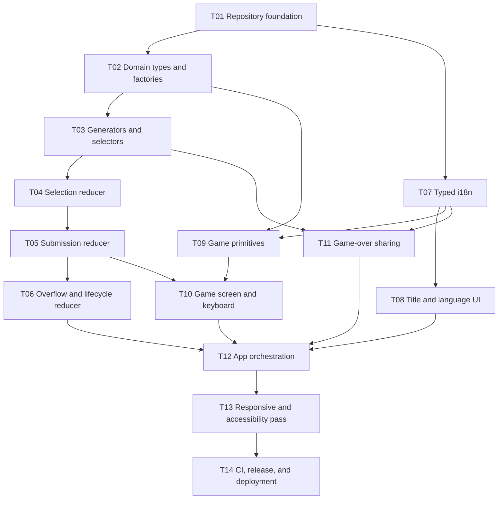

# Roadmap — Milestones, Dependency DAG, and Waves

### 4.1 Milestones

| Milestone | Outcome | Exit gate |
|---|---|---|
| `M0 — Repository Ready` | Reproducible local and CI toolchain | T01 merged; install, lint, typecheck, test, build pass |
| `M1 — Deterministic Game Core` | All game rules executable without React | T02–T07 merged; domain/i18n unit suite green |
| `M2 — Playable Bilingual PoC` | Complete mouse/touch/keyboard run loop | T08–T12 merged; integration suite green |
| `M3 — Release Candidate` | Responsive, accessible, deployable release | T13–T14 merged; release checklist and production smoke pass |

M0–M3 are closed; 1.0 shipped as `eb6cc67`. Post-release milestones follow.
Their planning lives in `docs/plan/tuning-and-design-system.md` and the
design docs under `docs/superpowers/specs/`.

**A milestone is the unit of merge** (AGENTS.md §4.4), so **every milestone
below must be a reasonable PR-sized goal.** If planning shows one is not, it
is split here before work starts — deliberately and on the record, never ad
hoc at branch time.

| Milestone | Outcome | Exit gate |
|---|---|---|
| `M4 — Endless Polish and Tuning Surface` | Reduced round friction, kind equation bias, and a single documented tuning surface | Discard collapse, Clear action, overflow keyboard access, `balance.ts`, and `balance.test.ts` merged; economy invariant green |
| `M5 — States Gallery` | Every component state viewable without playing to it | Dev-only `gallery.html` serves all five phases; absent from `dist/` after `npm run build` |
| `M5.5a — Design Contract Amendments` | The specification permits the Tile House system | §1.12, §1.14, §1.15, `product.md` §1.10 and the AGENTS.md motion constraint amended; `docs/design-system/` adopted; `T25`–`T27` filed |
| `M5.5b — Foundations and Identity` | Tile House tokens, self-hosted fonts, and the `ozterisk` wordmark | Token partials and global keyframes land; zero non-origin requests in a full run; Korean renders in a Hangul-capable face; focus indicator ≥ `3:1` on felt and ceramic |
| `M5.5c — Tile and Action Primitives` | One `Tile` and one `ActionButton`, replacing three and seven copies | Both primitives wired at every call site; accessible names unchanged; the focus indicator ≥ `3:1` on ceramic as well as felt; suite green |
| `M5.5d — Board Surfaces` | The rack, slots, equation, HUD and capacity meter wear the system | Rack holds ten sockets at every tier; a selected tile keeps its socket; round retains primary emphasis |
| `M5.5e — Flow Screens` | Title, feedback, overflow and game over wear the system | Answer slots stay mounted through feedback and carry no `button` role there; `role="status"` regions intact; the game-over screen has one focal point and ranks its own numbers; restart is bound to `R` and has a visible affordance; the title's four material rules are visible without interaction |
| `M5.5f — Motion` | The sixteen named moments | Every moment in the §1.12 inventory implemented; `prefers-reduced-motion` neutralises all of them |
| `M5.5g — Visual Verification` | The gallery proves it | Gallery covers hover, focus-visible, disabled and reduced-motion, and every state renders what its name claims; §8.5 walked with measured evidence at 320px in a real top-level viewport; reduced motion read per moment in both directions; no rack badge overlaps the engraved digit in either locale or either font face; `docs/design-system/` holds only what the product still reads |
| `M6 — Classic Core` | Classic playable: shrinking capacity and a definite run arc | Mode select and `getCapacity(round)` merged; both modes' economy invariants green |
| `M7 — Special Tiles` | Wildcard and restricted-face tiles, giving Classic its density-hoarding verb | Face-set tile mechanism and its digit picker merged; spawn rates tuned against Classic's descending ceiling |

`M4`, `M5`, `M5.5a`, `M5.5b`, `M5.5c`, `M5.5d`, `M5.5e`, `M5.5f` and `M5.5g` are
closed, merged as `16f2ff6`, `ecd76a1`, `f30929e`, `b933ca7`, `29708b8`,
`e4734e4`, `b6e801b`, `b95dcaa` and `9e40611`. **`M5.5` itself is not closed** —
see the `M5.5g` verdict below.

**`M5.5b` met its exit gate in three parts of four.** A full English run plus a
switch to Korean makes zero non-origin requests; Korean renders in Noto Sans KR,
measured by rendered width rather than `document.fonts.check()`; the token
partials and all ten global keyframes reach the document unscoped. The focus
indicator clears `3:1` on felt — `11.85` on all 176 sides of the eleven
controls whose ring lands there — but not on ceramic. The inventory tile's
ring lands on the tile's own `--shadow-tile` edge and reads `1.61`–`1.62` on
every tile at every tier, because `--ring-focus` is defined correctly and worn
by nothing. The fix composes the ring onto the tile's own elevation rather than
beside it, so it belongs wherever that elevation is declared — and `M5.5c` moves
it, collapsing `.tile` into a `Tile` primitive that owns a `--shadow-tile` edge
per size. So the gate `M5.5b` missed is `M5.5c`'s to close, not `M5.5d`'s:
assigning it to `M5.5d` would have aimed it at a rule that left
`TileInventory.module.css` a phase earlier. The design system's own `Tile.jsx`
already composes `box-shadow: <edge>, var(--ring-focus)`, but through
`onFocus`/`onBlur` handlers, which fire on click-focus as well; the port owes the
composition through `:focus-visible`, not the handlers. The gate above is left
as written: it is the standard, and `M5.5b` fell short of it. Measured across
111 readings in `docs/journal/journal-2026-09-02.md`.

**`M5.5f` will miss part of its exit gate, and the gate stays as written.** One
of the sixteen named moments — `10i`, the game-over table sweep — cannot be
built without either `GameScreen` outliving its own phase or `GameOverScreen`
growing a rack it does not have. The second is new product surface and would
need `product.md` §1.10 amended, and `M5.5f` is not a docs phase. Deferred as
#104, with the question it turns on stated there: should the game-over screen
show the final rack at all? Same precedent as `M5.5b` above — the gate is the
standard, and the phase falling short of it is recorded rather than the gate
being moved. Reasoning in `docs/journal/journal-2026-09-08.md`.

**`10i` is struck, and `M5.5f` is not re-scored for it.** `M5.5g` opened with
Ori's ruling on the question #104 stated: the game-over screen does not grow a
rack, so the sweep has nothing to play on and §1.12's inventory drops to
fifteen. That makes `M5.5f`'s gate — *every moment in the §1.12 inventory
implemented* — read true against the amended inventory, and it is **not** being
claimed retroactively. `M5.5f` shipped short of the gate as the gate stood on
the day it shipped, and the paragraph above stays as written. A gate is scored
against the standard in force when the phase closes, not against a later
amendment that happens to flatter it.

**`M5.5g` carries a docket, and three issues are deliberately not on it.**
The gate above gained the docket the phase inherited: #105 (three gallery
states that render something other than their name), #84 (rack badges over the
engraved digit — Ori's ruling is to delete the text badges and let the tile's
`reward` state carry the meaning), #94, #95 and #58. Left out, each for a
reason rather than by omission:

- **#64** — `dist/` carries ~1.0 MB of duplicate `.woff` files. A build-output
  defect; nothing in this gate touches the bundle.
- **#77** — lint CSS with Stylelint. Its own title says *once M5.5 settles*, and
  introducing a linter mid-verification would churn every stylesheet the phase
  exists to hold still.
- **#31** — the post-release tidy batch. Predates `M5.5` and is labelled
  post-release.

**#58 is the exception and stays in**: it was blocked only on `M5.5f` still
reading the storyboard canvases, and that block is gone.

**`M5.5g` met its exit gate in four parts of five, and the gate stays as
written.** The gallery covers hover, focus-visible, disabled and reduced motion
and every state renders what its name claims; reduced motion is read per moment
in both directions for all fifteen; no rack badge overlaps the engraved digit,
because `M5.5g` deleted the text badges outright; `docs/design-system/` holds
only what the product still reads. **The one miss is §8.5 at 320px, which is an
iframe reading rather than a top-level one** — this harness cannot foreground
a window to resize it, so `resize_window` reports success and `innerWidth`
never moves, and `window.open` at that width is popup-blocked. The sweep is
clean: nineteen states, both locales, zero elements past the right edge and no
horizontal scroll, at all seven widths #85 names. #85 stays open anyway, per
`T62`'s own rule that closing it on an iframe is not acceptable. Figures and
method in `docs/journal/journal-2026-09-12.md`.

**#85 is the sole open gate clause, and `M5.5` closes when it and #52 do.**
#85's bar is a reading in a real top-level viewport, which a person at a narrow
browser window satisfies and this harness cannot — so it is the one piece of
this milestone that is waiting on hardware rather than on work. #52, the
whole-UI tracking issue, closes with the milestone and only once the gate reads
met.

**The premise behind #114 was wrong, and the correction is worth keeping.** It
held that `8c`, `9b` and `10e` could not be read because no gallery entry holds
them at rest, and therefore needed gallery drivers built for them. Neither half
survives. A transition does not need a resting surface to be read: drive the
real control and catch the carrier, which for `8c` means an `animationstart`
listener, because under `reduce` the `1e-05s` animation retires the departing
tile before resolved style can be sampled. And `9b` had a resting surface the
whole time — `AnswerSlots.module.css` gives `.arriving` `animation-fill-mode:
both`, so a filled slot with no verdict holds `oz-slot-arrive` in resolved style
indefinitely, which is exactly what `answering-partial` and `answering-full`
render.

**Why M5.5 is a fraction.** The design pass was not on the roadmap when M6
and M7 were numbered, and it has to run once the gallery exists — the gallery
is what makes every state viewable without playing to it, which is the
precondition for tuning them. Renumbering `M6` and `M7` down would touch
`docs/journal/journal-2026-08-09.md`, which is a historical record: rewriting
it to match a later decision would falsify it. A fraction keeps the sequence
honest and the journal intact.

**Why the pass was split into seven.** It was originally scoped as two phases:
one working inside §1.12, one proposing an amendment to it with gallery screens
as evidence. That framing assumed the design work did not exist yet. It does —
`docs/design-system/` is a complete visual and motion system derived from this
codebase, and it contradicts §1.12, §1.14, §1.15, `product.md` §1.10 and the
AGENTS.md motion constraint. So the amendment is not the *last* step argued from
screens; it is the *first* step, argued from the design record, and everything
after it is compliant by construction.

The earlier two-phase reasoning is preserved in
`docs/journal/journal-2026-08-29.md`, which is a historical record and is not
rewritten to match this decision.

**Why seven and not one.** A milestone is the unit of merge, and one PR
carrying a token replacement, two new primitives, ten restyled components,
sixteen animations and a rename is not reviewable. §4.4 requires the split to
happen here, before work starts, rather than at branch time. `M5.5a` is
documentation only; `M5.5b` and `M5.5c` are strictly serial because everything
downstream consumes them; `M5.5d` fans out across non-overlapping components.

**Why M6 was split.** As originally scoped, `M6 — Classic Mode` bundled
shrinking capacity, mode select, *and* the face-set tile mechanism. The
face-set change alone spreads across `constructAnswer`, the closed `Digit`
union, `factories.ts`, `generators.ts`, `TileInventory.tsx`, and the
`tile.digitLabel` i18n key, plus a digit-picker UI — on its own comparable
in size to all of M4. Bundled, it failed the PR-sized bar.

The seam is principled rather than convenient: **M6 delivers a playable
mode, M7 adds content to it.** Shrinking capacity is what makes Classic a
different game; special tiles are what make it a deep one. Each ships
independently.

## 5. Dependency DAG and Execution Waves

| Wave | Tasks | Priority | Parallel rule | Wave exit gate |
|---|---|---|---|---|
| W0 | T01 | P0 | Single foundation task | Clean install and all scripts pass |
| W1 | T02, T07 | P0 | Parallel-safe; no overlapping paths | Domain types/factories and i18n independently green |
| W2 | T03, T08 | P0/P1 | Parallel-safe after their own dependencies | Pure game utilities and title entry complete |
| W3 | T04, T09, T11 | P0/P1 | Parallel-safe; separate paths | Selection reducer, game primitives, share service complete |
| W4 | T05 | P0 | Serialized because it edits reducer state transitions | Correct/incorrect submission suite green |
| W5 | T06, T10 | P0 | T10 may begin after T05; T06 and T10 touch different files except shared types are frozen | Full lifecycle reducer and phase UI complete |
| W6 | T12 | P0 | Integration task only | Complete playable loop and app tests green |
| W7 | T13 | P1 | Release-quality pass | Desktop/mobile/accessibility checklist green |
| W8 | T14 | P1 | Final gate | CI and production deployment green |

No agent may modify another active task's owned paths. If a shared type must change, pause the dependent task, land the type change through the owning prerequisite task, rebase, and rerun its gate.

### 7.5 Wave monitoring

At the end of every wave:

- [ ] All tasks in the wave are merged or explicitly waived by the user.
- [ ] All wave-owned focused tests pass.
- [ ] Full test suite passes.
- [ ] Typecheck passes.
- [ ] No out-of-scope dependency was added.
- [ ] No task in the next wave has an unresolved dependency.
- [ ] Update milestone progress and unblock the next wave.

## 10. Execution Handoff

Recommended execution mode: `superpowers:subagent-driven-development`, one fresh implementation agent per task, with specification review followed by quality review at every task boundary.

Alternative execution mode: `superpowers:executing-plans`, processing one wave at a time with a user-visible checkpoint after each wave.
