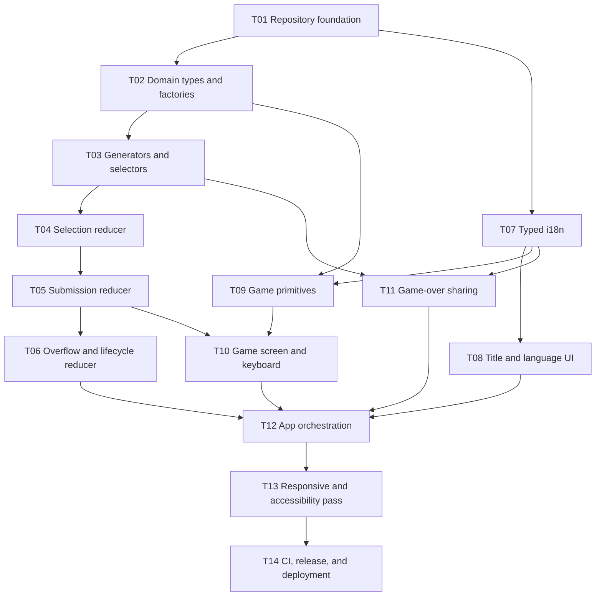

# Roadmap — Milestones, Dependency DAG, and Waves

### 4.1 Milestones

| Milestone | Outcome | Exit gate |
|---|---|---|
| `M0 — Repository Ready` | Reproducible local and CI toolchain | T01 merged; install, lint, typecheck, test, build pass |
| `M1 — Deterministic Game Core` | All game rules executable without React | T02–T07 merged; domain/i18n unit suite green |
| `M2 — Playable Bilingual PoC` | Complete mouse/touch/keyboard run loop | T08–T12 merged; integration suite green |
| `M3 — Release Candidate` | Responsive, accessible, deployable release | T13–T14 merged; release checklist and production smoke pass |

M0–M3 are closed; 1.0 shipped as `eb6cc67`. Post-release milestones follow.
Their planning lives in `docs/plan/tuning-and-design-system.md` and the
design docs under `docs/superpowers/specs/`.

| Milestone | Outcome | Exit gate |
|---|---|---|
| `M4 — Endless Polish and Tuning Surface` | Reduced round friction, kind equation bias, and a single documented tuning surface | Discard collapse, Clear action, overflow keyboard access, `balance.ts`, and `balance.test.ts` merged; economy invariant green |
| `M5 — States Gallery` | Every component state viewable without playing to it | Dev-only `gallery.html` serves all five phases; absent from `dist/` after `npm run build` |
| `M6 — Classic Mode` | Second mode: shrinking capacity, special tiles, definite run arc | Mode select, `getCapacity(round)`, and the face-set tile mechanism merged; both modes' economy invariants green |

## 5. Dependency DAG and Execution Waves

| Wave | Tasks | Priority | Parallel rule | Wave exit gate |
|---|---|---|---|---|
| W0 | T01 | P0 | Single foundation task | Clean install and all scripts pass |
| W1 | T02, T07 | P0 | Parallel-safe; no overlapping paths | Domain types/factories and i18n independently green |
| W2 | T03, T08 | P0/P1 | Parallel-safe after their own dependencies | Pure game utilities and title entry complete |
| W3 | T04, T09, T11 | P0/P1 | Parallel-safe; separate paths | Selection reducer, game primitives, share service complete |
| W4 | T05 | P0 | Serialized because it edits reducer state transitions | Correct/incorrect submission suite green |
| W5 | T06, T10 | P0 | T10 may begin after T05; T06 and T10 touch different files except shared types are frozen | Full lifecycle reducer and phase UI complete |
| W6 | T12 | P0 | Integration task only | Complete playable loop and app tests green |
| W7 | T13 | P1 | Release-quality pass | Desktop/mobile/accessibility checklist green |
| W8 | T14 | P1 | Final gate | CI and production deployment green |

No agent may modify another active task's owned paths. If a shared type must change, pause the dependent task, land the type change through the owning prerequisite task, rebase, and rerun its gate.

### 7.5 Wave monitoring

At the end of every wave:

- [ ] All tasks in the wave are merged or explicitly waived by the user.
- [ ] All wave-owned focused tests pass.
- [ ] Full test suite passes.
- [ ] Typecheck passes.
- [ ] No out-of-scope dependency was added.
- [ ] No task in the next wave has an unresolved dependency.
- [ ] Update milestone progress and unblock the next wave.

## 10. Execution Handoff

Recommended execution mode: `superpowers:subagent-driven-development`, one fresh implementation agent per task, with specification review followed by quality review at every task boundary.

Alternative execution mode: `superpowers:executing-plans`, processing one wave at a time with a user-visible checkpoint after each wave.
